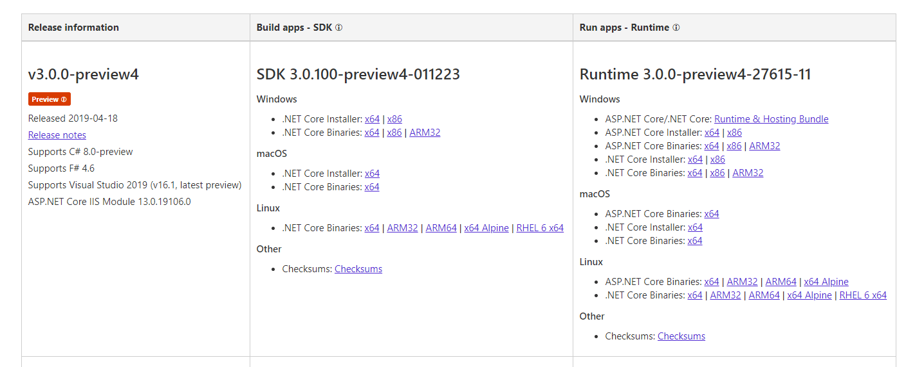
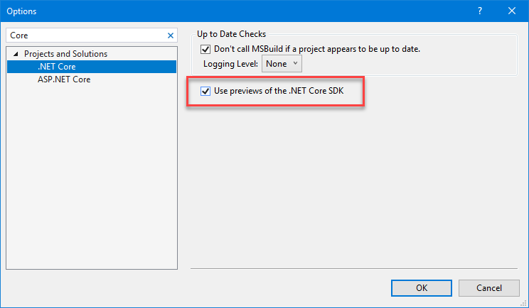
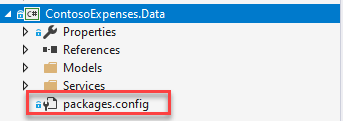
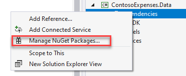
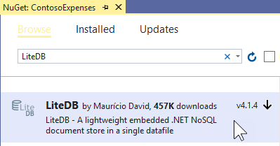
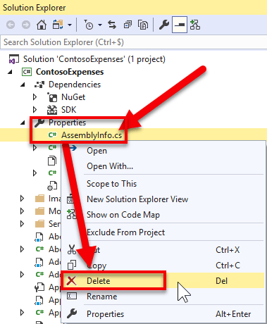
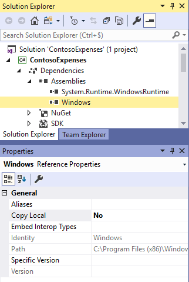
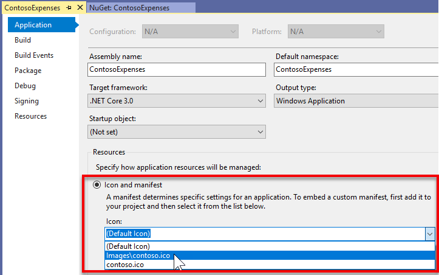

## Exercise 1 - Migrate to .NET Core 3
Migrating the application to .NET Core 3 is the best and recommended path for modernizing a .NET application (WPF or Windows Forms). As previously mentioned, the first really nice improvment is about the startup and execution time! This is only the tip of the iceberg. The best advantage is that, the app will be able to use all the upcoming new features both from .NET Core and UWP! 

___ 

### Exercise 1 Task 1 - Setup for using .NET Core 3
At the moment of writing .NET Core is still in Preview and it is highly experimental technologies. Nevertheless, it is enough stable to play with it. You will need to install the .NET Core 3 SDK, which is available at [https://dotnet.microsoft.com/download/dotnet-core/3.0](https://dotnet.microsoft.com/download/dotnet-core/3.0). Make sure to download the most recent Preview version.




___ 

### Exercise 1 Task 2 - Perform the migration - The csproj for the WPF App
As mentioned, .NET Core is in the Preview state. Visual Studio 2019 has been released. If you need to install it on your own box, here is the link: [https://visualstudio.microsoft.com/downloads/](https://visualstudio.microsoft.com/downloads/).

Let's open the solution using Visual Studio 2019:
1.  In Windows Explorer, navigate to `C:\WinAppsModernizationWorkshop\Lab\Exercise1\01-Start\ContosoExpenses` and double click on the `ContosoExpenses.sln` solution.
    
    The project ContosoExpenses is now open in Visual Studio but nothing changed: The application still uses the Full .NET 4.7.2. To verify this, just right click on the project in the Solution Explorer Windows and **Properties**.
    
    

    The *Target framework* of the project is displayed in the **Application** tab.
    
    

2.  Right click on the project in the solution explorer and choose **Unload Project**.

    

3.  Right click again on the project in the solution explorer ; click **Edit ContosoExpenses.csproj**.

    

4.  The content of the .csproj file looks like

    

    Do not be afraid, it is not the time to understand the whole csproj structure. You will see that the migration will be done easily: Just remove all the content of the file by doing **CTRL+A** and than  **SUPPR**!
    
    
    
5.  Start writing the new csproj file content by typing `<Project Sdk="Microsoft.NET.Sdk.WindowsDesktop"> </Project>` in the ContosoExpense.csproj. Microsoft.NET.Sdk.WindowsDesktop is the .NET Core 3 SDK for applications on Windows Desktop. It includes WPF and Windows Forms.

    

7.  Let's specify now a few details. To do this, insert a `<PropertyGroup></PropertyGroup>` element in inside the `<Project></Project>` element. 

    

8.  First, we indicate that the project output is a **executable** and not a dll. This is acheived by adding `<OutputType>WinExe</OutputType>` inside `<PropertyGroup></PropertyGroup>`.

> Note that, if the project output was a dll, this line has to be omitted.

9.  Secondly, we specify that the project is using .NET Core 3: Just below the <OutputType> line, add ` <TargetFramework>netcoreapp3.0</TargetFramework>`

10. Lastly, we point out that this is a WPF application in adding a third line: `<UseWPF>true</UseWPF>`.

> If the application is Windows Forms, we do not need this third line.

#### Summary, verification and last step

- The project using .NET Core 3 and the **Microsoft.NET.Sdk.WindowsDesktop** SDK
- Output is an **application** so we need the `<OutputType>` element
- `<UseWPF>` is self-describing

Here is the full content of the new csproj. Please double check that you have everything:

```xml
<Project Sdk="Microsoft.NET.Sdk.WindowsDesktop">

  <PropertyGroup>
    <OutputType>WinExe</OutputType>
    <TargetFramework>netcoreapp3.0</TargetFramework>
    <UseWPF>true</UseWPF>
  </PropertyGroup>

</Project>
```

By default, with the new project format, all the files in the folder are considered part of the solution. As such, we don't have to specify anymore each single file included in the project, like we had to do the old .csproj file. We need to specify only the ones for which we need to define a custom build action or that we want to exclude. 
It is now safe to save file by pressing **CTRL+S**.

Last point: To be able to use a preview of .NET Core 3, in Visual Studio 2019, please go to **TOOLS** / **Options...** and type "Core" in the search box. Check the **Use previews of the .NET Core SDK**.


___ 

### Exercise 1 Task 3 - Perform the migration - The csproj for the class library
The Contoso Expenses solution is using a class library with some models and interfaces for Services. The class library project is also a .NET 4.7.2 project. Let's see how to migrate the project to .NET Core 3:

1.  Right click on the **ContosoExpenses.Data** project in the solution explorer and choose **Unload Project**.

2.  Right click again on the project in the solution explorer ; click **Edit ContosoExpenses.Data.csproj**.

3. Remove all the content of the file by doing **CTRL+A** and than **SUPPR**.
    
4. Because we explained all part of the new XML tags for the .NET Core 3 project, just use the following content and save the file:

```xml
<Project Sdk="Microsoft.NET.Sdk">

  <PropertyGroup>
    <TargetFramework>netstandard2.0</TargetFramework>
  </PropertyGroup>

</Project>
```

> **Note:** This time, we use the .NET Standard 2.0 wich is highly portable/compatible with cross-platform apps. This way, you can see there that this class library could be shared with others apps on others platforms (MacOS, Linux) and still with existing full .NET apps on Windows.

___

### Exercise 1 Task 4 - Perform the migration - NuGet packages and references of the projects

1.  The two csproj are saved. Let's reopen the projects: Go to the **Solution Explorer**, right click on each project and choose **Reload project**.

    
    
2.  Visual Studio just asks for a confirmation ; click **yes**.

    
    
3.  The projects should load correctly. But remember: The NuGet packages used by the projects were gone by removing all the content of the csproj! 

4.  You have a confirmation by expending the **Dependencies/NuGet** node of the main project in which you have only the .NET Code 3 package.

    
    
    Also, if you click on the **Packages.config** in the **Solution Explorer**. You will find the 'old' references of the NuGet packages used the project when it was using the full .NET Framework.
    
    
    
    Here is the content of the **Packages.config** file. You notice that all NuGet Packages target the Full .NET Framework 4.7.2:
    
    ```xml
    <?xml version="1.0" encoding="utf-8"?>
    <packages>
      <package id="CommonServiceLocator" version="2.0.2" targetFramework="net472" />
      <package id="MvvmLightLibs" version="5.4.1.1" targetFramework="net472" />
      <package id="System.Runtime.CompilerServices.Unsafe" version="4.5.2" targetFramework="net472" />
      <package id="Unity" version="5.10.2" targetFramework="net472" />
    </packages>
    ```

5. From the main project (**ContosoExpenses**), delete the file **Packages.config** by right clicking on it and **Delete** in the **Solution Explorer**.

6. Right click on the **Dependencies** node of the **ContosoExpenses** project in the **Solution Explorer** and **Manage NuGet Packages...**

  

7. Click on **Browse** at the top left of the opened window and search for `Bogus`. The package by Brian Chavez should be listed. Install it.

    

8. Do the same for `LiteDB`. This package is provided by Mauricio David.

    

> Isn't it strange that we add the same packages as the ones used by the .NET Framework 4.7.2?

NuGet packages supports multi-targeting. You can include, in the same package, different versions of the library, compiled for different architectures. If you give a closer look at the packages' details, you will see that, other than supporting the full .NET Framework, it includes also a .NET Standard 2.0 version, which is perfect for .NET Core 3 (Further details on .NET Framework, .NET Core and .NET Standard at [https://docs.microsoft.com/en-us/dotnet/standard/net-standard](https://docs.microsoft.com/en-us/dotnet/standard/net-standard)).


9. We need some other NuGet packages: `MvvmLightLibs` by Laurent Bugnion, `Unity` by Unity Container Project.

> Since we don't have anymore a packages.config file, can you guess where the list of NuGet packages gets stored?

With the new project format, the referenced NuGet packages are stored directly in the .csproj file. You can check this by right clicking on the **ContosoExpenses** project in Solution Explorer and choosing **Edit ContosoExpenses.csproj**. You will find the following lines added at the end of the file:

```xml
TODO
  <ItemGroup>
    <PackageReference Include="Bogus" Version="25.0.4" />
    <PackageReference Include="LiteDB" Version="4.1.4" />
  </ItemGroup>
```

10. For the **ContosoExpenses.Data** project, please add the following NuGet packages: `Bogus` and `LiteDB`.

11. The last reference which is missing is the **ContosoExpenses.Data** in the **ContosoExpenses project**: Right click on the **Dependencies** node of the **ContosoExpenses** project in the **Solution Explorer** and **Add Reference...**.

12. Select **ContosoExpenses.Data** from the **Projects \ Solution** category.

    

___ 

### Exercise 1 Task 4 - Perform the migration - Fixing AssemblyInfo.cs

Let's try to build it in order to 'discover' what we have to do to complete the migration. Use the **Build** menu and **Build solution**.

Oupss...


The Preview version of .NET Core 3 and Visual Studio 2019 causes some errors. It is not interesting to give explanations here: It is only 'piping' we have to resolve by either removing the mentioned lines in the `AssemblyInfo.cs` file or just delete the file. We go for the simpliest. 

1.  In the **Solution Explorer** window / Under the **ContosoExpenses** project, expand the **Properties** node and right click on the **AssemblyInfo.cs** file ; Click on **Delete**.
    
    
    
2. Do the same for the **ContosoExpenses.Data** project.

3.  Just rebuild the project (for example using CTRL+SHIFT+B). Yeah!

    ```dos
    1>------ Build started: Project: ContosoExpenses.Data, Configuration: Debug Any CPU ------
    1>C:\Program Files\dotnet\sdk\3.0.100-preview4-011033\Sdks\Microsoft.NET.Sdk\targets\Microsoft.NET.RuntimeIdentifierInference.targets(151,5): message NETSDK1057: You are using a preview version of .NET Core. See: https://aka.ms/dotnet-core-preview
    1>ContosoExpenses.Data -> C:\WinAppsModernizationWorkshop\Lab\Exercise1\01-Start\ContosoExpenses.Data\bin\Debug\netstandard2.0\ContosoExpenses.Data.dll
    2>------ Build started: Project: ContosoExpenses, Configuration: Debug Any CPU ------
    2>C:\WinAppsModernizationWorkshop\Lab\Exercise1\01-Start\ContosoExpenses\ContosoExpenses.csproj : warning NU1701: Package 'MvvmLightLibs 5.4.1.1' was restored using '.NETFramework,Version=v4.6.1' instead of the project target framework '.NETCoreApp,Version=v3.0'. This package may not be fully compatible with your project.
    2>ContosoExpenses -> C:\WinAppsModernizationWorkshop\Lab\Exercise1\01-Start\ContosoExpenses\bin\Debug\netcoreapp3.0\ContosoExpenses.dll
    2>Done building project "ContosoExpenses.csproj".
    ========== Build: 2 succeeded, 0 failed, 0 up-to-date, 0 skipped ==========
    ``` 

___ 

### Exercise 1 Task 5 - Perform the migration - Adding a reference to the Universal Windows Platform

This error is our fault because we removed everything in the csproj at the beginning of the exercise. 

> This method for migrating the project to .NET Core 3 is manual because Visual Studio 2019 Preview does not handle yet the migration work for us. The Visual Studio team is working to make the migration path easier and smoother in the future.

So to fix this error, we have to reference again the Universal Windows Platform again. This was done in the Exercise 2 Task 3. Here are the same steps:

In order to be able to use the Universal Windows Platform APIs in a WPF application we need to add a reference to two files:

- **Windows.md**, which contains the metadata that describes all the APIs of the Universal Windows Platform.
- **System.Runtime.WindowsRuntime** which is a library that contains the infrastructure required to properly support the **IAsyncOperation** type, which is used by the Universal Windows Platform to handle asynchronous operation with the well known async / await pattern. Without this library your options to interact with the Universal Windows Platform would be very limited, since all the APIs which take more than 50 ms to return a result are implemented with this pattern.

1. Go back to Visual Studio and right click on the **ContosoExpenses** project.
2. Choose **Add reference**.
3. Press the **Browse** button.
4. Look for the following folder on the system: `C:\Program Files (x86)\Windows Kits\10\UnionMetadata\10.0.17763.0\`
5. Change the dropdown to filter the file types from **Component files** to **All files**. This way, the `Windows.md` file will become visible.

    
    
6. Select it and press **Add**.
7. Now press again the **Browse** button.
8. This time look for the following folder on the system: `C:\Windows\Microsoft.NET\Framework\v4.0.30319`
9. Look for a file called `System.Runtime.WindowsRuntime.dll`, select it and press Ok.
10. Now expand the **References** section of the **ContosoExpenses** project in Solution Explorer and look for the **Windows** reference.

    
   
11. Select it, right it click on it and choose **Properties**.
12. Change the value of the **Copy Local** property to **No**.
13. Rebuild the project (CTRL+SHIFT+B) and... you succeed!

```dos
=======___ Build: 1 succeeded, 0 failed, 0 up-to-date, 0 skipped ==========
```

___ 

### Exercise 1 Task 7 - Perform the migration - Debug

We are ok to finally, launch the app.

1.  Use the **Debug** menu / **Start Debugging F5**

> You had an exception. What is it that? Don't we finished the migration? Can you find the root cause of the issue reading the Exception Debug popup displayed by Visual Studio?


Strange because the images files are in the solution and the path seems correct.


> Why do we get this file not found exception?

In fact, it is simple. Again, as we hardly deleted all the content of the csproj file at the beginning of the migration, we removed the information about the **Build action** for the images' files. Let fix it.

2.  In the **Solution Explorer**, select all the images files except the contoso.ico ; In the properties windows choose **Build action** = `Content` and **Copy to Output Directory** = `Copy if Newer`

    

3.  To assign the Contoso.ico to the app, we have to right click on the project in the **Solution Explorer** / **Properties**. In the opened page, click on the dropdown listbox for Icon and select `Images\contoso.ico`

    


We are done! Test the app in debug with F5 and it should work... Everything running using .NET Core 3!

We are now ready to go further and use all the power of the full UWP ecosystem controls, packages, dlls.

___ 

### Exercise 1 Task 8 - Supporting the Desktop Bridge
Before wrapping up the exercise, let's make sure that also the Desktop Bridge version of our WPF application based on .NET Core works fine, so that we can leverage all the UWP APIs and the deep Windows 10 integration also with our migrated WPF project.

1. Right click on the **ContosoExpenses.Package** project and choose **Set as StartUp Project**.
2. Right click on the **ContosoExpenses.Package** project and choose **Rebuild**.
3. The build operation will fail with the following error:

    
    
    The error is happening because, when a .NET Core application is running packaged with the Desktop Bridge, it's included as self-contained, which means that the whole .NET Core runtime is embedded with the application. Thanks to this configuration, we can deploy the package on any Windows 10 machine and run it, even if it doesn't have the .NET Core runtime installed. However, when we package the application with the Desktop Bridge, we can't use the **Any CPU** compilation architecture, but we need to specify which runtimes we support. As such, we need to add this information in the **.csproj** file of our WPF project.
4. Right click on the **ContosoExpenses** project in Solution Explorer and choose **Edit ContosoExpenses.csproj**.
5. Add the following entry inside the **PropertyGroup** section:

    ```xml
    <RuntimeIdentifiers>win-x86;win-x64</RuntimeIdentifiers>
    ```
    
    This is how the full **PropertyGroup** should look like:
    
    ```xml
    <PropertyGroup>
      <OutputType>WinExe</OutputType>
      <TargetFramework>netcoreapp3.0</TargetFramework>
      <UseWPF>true</UseWPF>
      <ApplicationIcon />
      <RuntimeIdentifiers>win-x86;win-x64</RuntimeIdentifiers>
    </PropertyGroup>
    ```
    
    We are explictly saying that our WPF application can be compiled both for the x86 and x64 architectures for the Windows platform.
    
6. Now press CTRL+S, then right click again on the **ContosoExpenses.Package** and choose **Rebuild**.
7. This time the compilation should complete without errors. If you still see an error related to the **project.assets.json** file, right click on the **ContosoExpenses** project in Solution Explorer and choose **Open Folder in File Explorer**. Delete the **bin** and **obj** folders and rebuild the **ContosoExpenses.Package** project.
8. Now press F5 to launch the application.

Congratulations! You're running a .NET Core 3.0 WPF application!

WORK IN PROGRESS