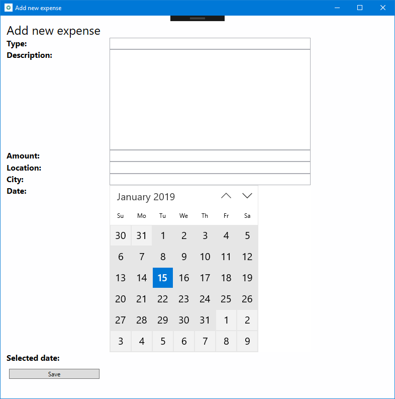
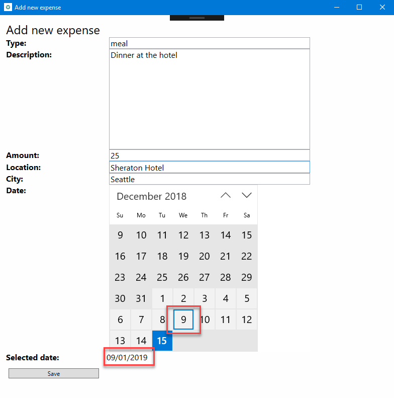

## Exercise 4 - Create a XAML Islands wrapper
In Excercise 3 we have added a **CalendarView** control to our WPF application using the generic **WindowsXamlHost** control.
From a technical point of view, the outcome of the exercise worked without issues. However, the code we have written isn't super elegant. In order to interact with the **CalendarView** control we had to subscribe to the **ChildChanged** event exposed by the **WindowsXamlHost** control, peform a cast and subscribe to an event. Since the properties we need weren't directly exposed by the **WindowsXamlHost** control, we had to break the MVVM pattern and implement some logic inside the code-behind instead of the ViewModel.

Wouldn't it be better if we could use the **CalendarView** control like a native WPF control and create a binding channel between the **Date** property in the ViewModel and the **SelectedDates** property of the control?

We can solve this problem by creating our own wrapper to the UWP control we want to integrate, similar to **InkCanvas** control we have used in Exercise 2. The purpose of this wrapper is to take the properties and events exposed by the UWP control and forward them to the WPF control, so that they could be directly accessed like with a native .NET control. Let's start!

___ 

### Exercise 4 Task 1 - Create a basic wrapper

1. If you have completed Exercise 3, you can start from the outcome of it. Otherwise, open the folder `C:\XAMLIslandsLab\Lab\Exercise5\01-Start\ContosoExpenses` and double click on the **ContosoExpenses.sln** file.
2. First we need to create the wrapper control. Right click on the **ContosoExpenses** project in Solution Explorer and choose **Add -> Class**. 
3. Name it `CalendarViewWrapper` and press OK.
4. Add a reference to the following namespaces at the top of the class:

    ```csharp
    using Microsoft.Toolkit.Win32.UI.XamlHost;
    using Microsoft.Toolkit.Wpf.UI.XamlHost;
    ```
5. The first step is to make the class public and to inherit from the **WindowsXamlHostBase**. This is how the definition should look like:

    ```csharp
    public class CalendarViewWrapper: WindowsXamlHostBase
    {
    }
    ```

6. The next step is to initialize the control with the UWP control we want to host, in our case the **CalendarView** one. Copy and paste the following code inside the class:

    ```csharp
    protected override void OnInitialized(EventArgs e)
    {
        base.OnInitialized(e);
        this.ChildInternal = UWPTypeFactory.CreateXamlContentByType("Windows.UI.Xaml.Controls.CalendarView");
    
        SetContent();
    }
    ```
    
    We're overriding the **OnInitialized** event and, inside it, we're using a class provided by the Windows Community Toolkit called **UWPTypeFactory**. Thanks to the **CreateXamlContentByType()** method we can manually create a new instance of the UWP control we need. This code has the same effect of setting the **InitialTypeName** property on the **WindowsXamlHost** control as we did in Exercise 3. Once we have a reference to the UWP control, we assign it to the **ChildInternal** property, which is the host. In the end, we call the **SetContent()** to finalize the operation.

7. Now that we have a basic wrapper, we can use it to replace the **WindowsXamlHost** control we have previously added. Double click on the **AddNewExpense.xaml** file in Solution Explorer and locate the **WindowsXamlHost** control:

    ```xml
    <xamlhost:WindowsXamlHost InitialTypeName="Windows.UI.Xaml.Controls.CalendarView" Grid.Column="1" Grid.Row="6" Margin="5, 0, 0, 0" x:Name="CalendarUwp" ChildChanged="CalendarUwp_ChildChanged"/>
    ```
8. Delete it and replace it with the following snippet:

    ```xml
    <local:CalendarViewWrapper Grid.Column="1" Grid.Row="6" Margin="5, 0, 0, 0" />
    ```

    We are simply referencing the **CalendarViewWrapper** control we have just created, using the **local** prefix which is already included in the **Window** definition and which points to the default namespace of the project:
    
    ```xml
    xmlns:local="clr-namespace:ContosoExpenses"
    ```
    
We're ready to start performing a first test. Press F5 and launch the application, then select one of the available employees and press the **Add new expense** button. You should see the same visual output of the previous exercise:



However, the current iteration isn't really useful. If you click on any date, nothing will happen. We need to customize our wrapper in order to expose the properties we need.

___ 

### Exercise 4 Task 2 - Add properties to the wrapper
Let's start by adding some properties to our wrapped control. For our scenario, we need to expose as a property the date selected by the user.

1. Double click on the **CalendarViewWrapper.cs** file in Solution Explorer 
2. We're going to create this property as a dependency property, since we want to leverage binding so that we can use it directly from our ViewModel. Copy and paste the following code inside the **CalendarViewWrapper** class, after the **OnInitialized()** method:

    ```csharp
    public DateTimeOffset SelectedDate
    {
      get { return (DateTimeOffset)GetValue(SelectedDateProperty); }
      set { SetValue(SelectedDateProperty, value); }
    }
    
    public static readonly DependencyProperty SelectedDateProperty =
      DependencyProperty.Register("SelectedDate", typeof(DateTimeOffset), typeof(CalendarViewWrapper), new PropertyMetadata(DateTimeOffset.Now));
    ```
    
    We have created a dependency property which type is **DateTimeOffset**, which is the same type used by the **CalendarView** control to handle dates.

3. Now that we have a property where to store the selected date, we need to set its value whenever the user will choose a date from the **CalendarView** control. We can achieve this goal by subscribing to the **SelectedDatesChanged** event, like we did in Exercise 3.

4. Copy and paste the following code inside the **OnInitialized()** event, after the **SetContent()** method:

    ```csharp
    Windows.UI.Xaml.Controls.CalendarView calendarView = this.ChildInternal as Windows.UI.Xaml.Controls.CalendarView;
    calendarView.SelectedDatesChanged += CalendarView_SelectedDatesChanged;
    ```
    
    The control which is hosted by the wrapper is exposed through the **ChildInternal** property. As such, we can cast it to the control we're hosting (**CalendarView**) and we can access to its properties and events. In this case, we just subscribe to the **SelectedDatesChanged** event.
    
3. Now we can implement an event handler for this event. Copy and paste the following code at the end of the class:

    ```csharp
    private void CalendarView_SelectedDatesChanged(Windows.UI.Xaml.Controls.CalendarView sender, Windows.UI.Xaml.Controls.CalendarViewSelectedDatesChangedEventArgs args)
    {
        SelectedDate = args.AddedDates[0];
    }
    ```

    We're simply setting the dependency property we have just defined with the first value of the **AddedDates** collection. Remember that, since we're using the control in single selection mode, the collection will always include only a single element.

4. Now that the selected date is exposed through a dependency property, we don't need any more to handle the date selection in code behind. We can just bind the **SelectedDate** property exposed by our wrapper to the **Date** property of the ViewModel.
5. Double click on the **AddNewExpense.xaml** file inside the **Views** folder in Solution Explorer.
6. Locate the wrapper you have previously added towards the end of the file and set the **SelectedDate** property as in the following sample:

```xml
<local:CalendarViewWrapper Grid.Column="1" Grid.Row="6" Margin="5, 0, 0, 0" SelectedDate="{Binding Path=Date, Mode=TwoWay}" />
```

Now we can test the code. Press F5 to launch the application, choose an employee from the list and press the **Add new expense** button. Now the control should behave like at the end of Exercise 4:

- By clicking on a date, you will see the selected date displayed under the calendar.
- If you press **Save** and you look at the **Date** column of newly added expense, you will see the same date selected in the calendar.



That's it! Our wrapper is working and it makes easier to interact with the original UWP control directly from the WPF XAML. Additionally, we were able to use the wrapper through binding, which allowed us to maintain the code cleaner and to continue leveraging the MVVM pattern.

___ 

### Exercise 4 Task 3 - Cleaning the code
Since now we have a wrapper that can be used directly in our ViewModel thanks to binding, we can cleanup some of the code we have added in Exercise 3:

1. Double click on the **AddNewExpense.xaml** file in the **Views** folder in Solution Explorer.
2. Locate, in the **Window** element, the namespace we have declared to add the **WindowsXamlHost** control and remove it. We don't need it anymore, since it has been replaced by our wrapper:

    ```xml
    xmlns:xamlhost="clr-namespace:Microsoft.Toolkit.Wpf.UI.XamlHost;assembly=Microsoft.Toolkit.Wpf.UI.XamlHost"
    ```

3. Double click on the **AddNewExpense.xaml.cs** file in the **Views** folder in Solution Explorer.
4. Delete the **CalendarUwp_ChildChanged** event handler. Now the logic to handle the date selection is encapsulated direcly inside the wrapper.
5. Double click on the **AddNewExpenseViewModel.cs** file in the **ViewModels** folder in Solution Explorer.
6. In the public constructor delete the messenger registration of the **SelectedDateMessage** object. Since now the selected date is exposed directly with a depededency property by our wrapper, we can set the **Date** property of the ViewModel directly through binding.

    ```csharp
    Messenger.Default.Register<SelectedDateMessage>(this, message =>
    {
        Date = message.SelectedDate;
    });
    ```
7. We can now safely delete also the class we have used as a message to store the selected date. Expand the **Messages** folder in Solution Explorer, right click on the **SelectedDateMessage.cs** file and choose **Delete**.

That's it. Now our project should continue to compile just fine and still retain all the features we have implemented in Task 2.