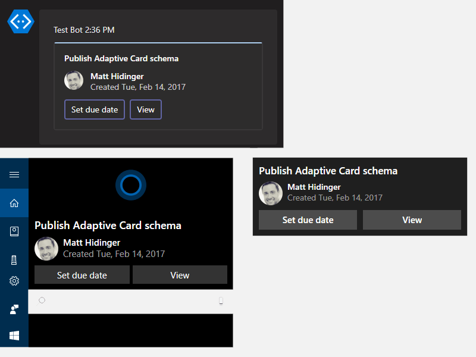
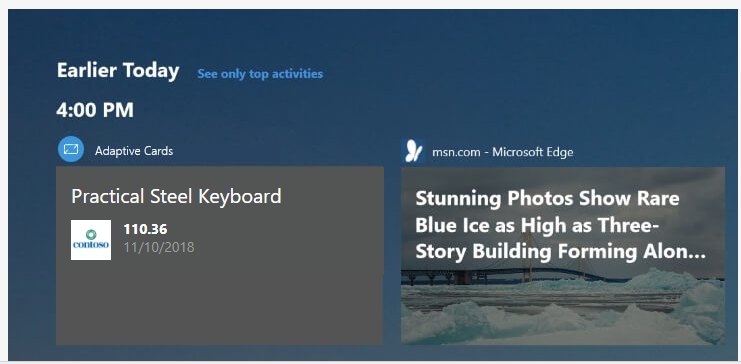
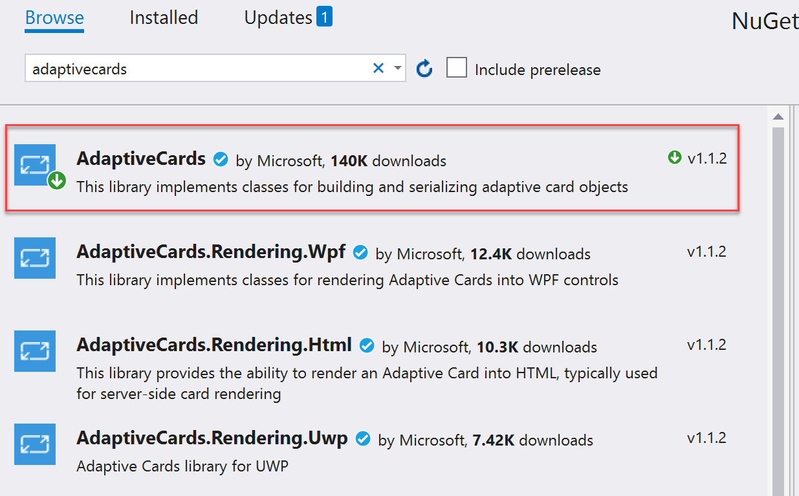
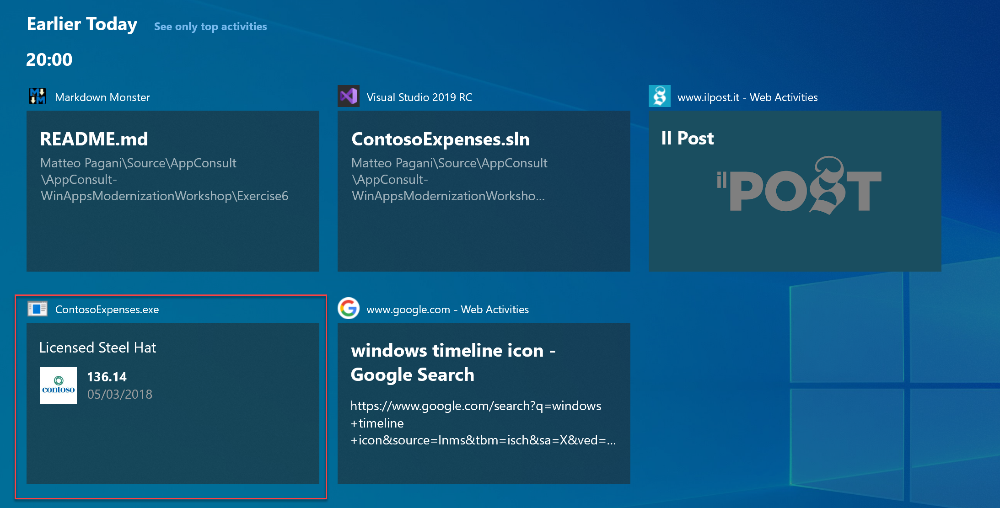

## Exercise 5 - Adding Windows 10 features to the application
In Exercise 3 we have added the Universal Windows Platform to our WPF application, so that we could use the CalendarView control. By doing this, however, we didn't just add the opportunity to use any control from the Universal Windows Platform, but also new features offered by Windows 10.
The development team of Contoso Expenses has decided to take this opportunity to include two new features in the application: Activities and Notifications. 

Let's start with Activities! In Windows 10 applications can track activities performed by the user within an application, like opening a file or displaying a specific page. These activities are then made available through Timeline, a feature introduced in Windows 10 1803, which allows the user to quickly go back to the past and resume an activity he did.


Activities are tracked using the Microsoft Graph. However, when you're building a Windows 10 application, you don't need to manually interact with the REST endpoints provided by Microsoft Graph, but you can use a convenient set of APIs included in the Universal Windows Platform. We're going to use them in our WPF application to track every time the user opens an expense within the application.

Let's start!

### Exercise 5 Task 1 - Add an Adaptive Card
Adaptive Cards are a new way for developers to exchange card content in a common and consistent way. An Adaptive Card is described by a JSON payload, which defines its content: text, images, actions, etc.
An adaptive card defines just the content and not the visual styles. It will be up to the platform where the adaptive card will be received it to render it, using the most appropriate styling. The way Adaptive Cards are designed is through [a renderer](https://docs.microsoft.com/en-us/adaptive-cards/rendering-cards/getting-started), which is able to take the JSON payload and to convert it into native UI: it could be XAML for a WPF or UWP application, AXML for an Android application, HTML for a website or a bot chat, etc.

This is an example of a simple adaptive card's payload:

```json
{
    "type": "AdaptiveCard",
    "body": [
        {
            "type": "Container",
            "items": [
                {
                    "type": "TextBlock",
                    "size": "Medium",
                    "weight": "Bolder",
                    "text": "Publish Adaptive Card schema"
                },
                {
                    "type": "ColumnSet",
                    "columns": [
                        {
                            "type": "Column",
                            "items": [
                                {
                                    "type": "Image",
                                    "style": "Person",
                                    "url": "https://pbs.twimg.com/profile_images/3647943215/d7f12830b3c17a5a9e4afcc370e3a37e_400x400.jpeg",
                                    "size": "Small"
                                }
                            ],
                            "width": "auto"
                        },
                        {
                            "type": "Column",
                            "items": [
                                {
                                    "type": "TextBlock",
                                    "weight": "Bolder",
                                    "text": "Matt Hidinger",
                                    "wrap": true
                                },
                                {
                                    "type": "TextBlock",
                                    "spacing": "None",
                                    "text": "Created {{DATE(2017-02-14T06:08:39Z,SHORT)}}",
                                    "isSubtle": true,
                                    "wrap": true
                                }
                            ],
                            "width": "stretch"
                        }
                    ]
                }
            ]
        }
    ],
    "actions": [
        {
            "type": "Action.ShowCard",
            "title": "Set due date",
            "card": {
                "type": "AdaptiveCard",
                "style": "emphasis",
                "body": [
                    {
                        "type": "Input.Date",
                        "id": "dueDate"
                    },
                    {
                        "type": "Input.Text",
                        "id": "comment",
                        "placeholder": "Add a comment",
                        "isMultiline": true
                    }
                ],
                "actions": [
                    {
                        "type": "Action.OpenUrl",
                        "title": "OK",
                        "url": "http://adaptivecards.io"
                    }
                ],
                "$schema": "http://adaptivecards.io/schemas/adaptive-card.json"
            }
        },
        {
            "type": "Action.OpenUrl",
            "title": "View",
            "url": "http://adaptivecards.io"
        }
    ],
    "$schema": "http://adaptivecards.io/schemas/adaptive-card.json",
    "version": "1.0"
}
```

The image below shows how this JSON is being rendered in a different way by the target platform: a Teams channel, Cortana and a Windows notification.



Adaptive cards play an important role in Timeline because it's the way Windows renders activities. Each thumbnail displayed inside Timeline is actually an Adaptive Card. As such, when you're going to create a user activity inside your application, you will be asked to provide an Adaptive Card to render it.

So let's create it! We're going to build an Adaptive Card which looks like this:



A great way to brainstorm the design of an Adaptive Card is using [the online designer](https://adaptivecards.io/designer/). You will have the chance to design the card with building blocks (images, texts, columns, etc) and to get the corresponding JSON. Once you have an idea of the final design, you can use a library called [Adaptive Cards](https://www.nuget.org/packages/AdaptiveCards/) to make easier to build your Adaptive Card using C# classes instead of plain JSON, which might be hard to debug and build.

1. Right click on the **ContosoExpenses** project in Solution Explorer and choose **Manage NuGet packages**.
2. Look for the package with identifier **AdaptiveCards** and install it.

    

3. Now let's create a class to host the code we need to interact with Timeline. Right click on the project in Solution Explorer, choose **Add -> Class** and name it **TimelineService.cs**.
4. Add the following namespace at the top of the class:

    ```csharp
    using AdaptiveCards;
    ```

5. Copy and paste inside the class the following method:

   ```csharp
    private string BuildAdaptiveCard(Expense expense)
    {
        AdaptiveCard card = new AdaptiveCard("1.0");
    
        AdaptiveTextBlock title = new AdaptiveTextBlock
        {
            Text = expense.Description,
            Size = AdaptiveTextSize.Medium,
            Wrap = true
        };
    
        AdaptiveColumnSet columnSet = new AdaptiveColumnSet();
    
        AdaptiveColumn photoColumn = new AdaptiveColumn
        {
            Width = "auto"
        };
    
        AdaptiveImage image = new AdaptiveImage
        {
            Url = new Uri("https://appmodernizationworkshop.blob.core.windows.net/contosoexpenses/Contoso192x192.png"),
            Size = AdaptiveImageSize.Small,
            Style = AdaptiveImageStyle.Default
        };
        photoColumn.Items.Add(image);
    
        AdaptiveTextBlock amount = new AdaptiveTextBlock
        {
            Text = expense.Cost.ToString(),
            Weight = AdaptiveTextWeight.Bolder,
            Wrap = true
        };
    
        AdaptiveTextBlock date = new AdaptiveTextBlock
        {
            Text = expense.Date.Date.ToShortDateString(),
            IsSubtle = true,
            Spacing = AdaptiveSpacing.None,
            Wrap = true
        };
    
        AdaptiveColumn expenseColumn = new AdaptiveColumn
        {
            Width = "stretch"
        };
        expenseColumn.Items.Add(amount);
        expenseColumn.Items.Add(date);
    
        columnSet.Columns.Add(photoColumn);
        columnSet.Columns.Add(expenseColumn);
    
        card.Body.Add(title);
        card.Body.Add(columnSet);
    
        string json = card.ToJson();
        return json;
    }
    ```

    This method takes, as input, an **Expense** object with all the information about the expense to render and builds a new **AdaptiveCard** object. Inside it, it adds:
    
    - A title, which uses the description of the expense
    - An image, which is the Contoso logo
    - The amount of the expense
    - The date of the expense
    
    The last 3 elements are split into two different columns, so that the Contoso logo and the details about the expense can be placed side by side. Once the object has been built, we return the corresponding JSON thanks to the **ToJson()** method.
    
### Exercise 5 Task 2 - Add a user activity
    
Now that our Adaptive Card is ready, we need a method to create a user activity based on it.

1. Add the following namespaces at the top of **TimelineService** class: 

    ```csharp
    using Windows.ApplicationModel.UserActivities;
    using Windows.UI.Shell;
    ```
    
    These namespaces are part of the Universal Windows Platform but, thanks to the NuGet package we have installed in Exercise 3, we are able to use these APIs without issues.
2. Then declare the following objects at class level:

    ```csharp
    private UserActivityChannel _userActivityChannel;
    private UserActivity _userActivity;
    private UserActivitySession _userActivitySession;
    ```

3. Now copy and paste the following method inside the class:

    ```csharp
    public async Task AddToTimeline(Expense expense)
    {
        _userActivityChannel = UserActivityChannel.GetDefault();
        _userActivity = await _userActivityChannel.GetOrCreateUserActivityAsync($"Expense-{expense.ExpenseId}");
    
        _userActivity.ActivationUri = new Uri($"contosoexpenses://expense/{expense.ExpenseId}");
        _userActivity.VisualElements.DisplayText = "Contoso Expenses";
    
        string json = BuildAdaptiveCard(expense);
    
        _userActivity.VisualElements.Content = AdaptiveCardBuilder.CreateAdaptiveCardFromJson(json);
    
        await _userActivity.SaveAsync();
        _userActivitySession?.Dispose();
        _userActivitySession = _userActivity.CreateSession();
    }
    ```
    
    First we get a reference to the **UserActivityChannel** which is required to store user activities, by invoking the **GetDefault()** method. Then we create a new user activity using the **GetOrCreateUserActivityAsync()** method, which requires a unique identifier. This way, if an activity already exists, we'll be able to update it; otherwise we'll create a new one.
    
    The behavior to implement now depends by the kind of application you're building:
    
    - If you want to always update the same activity so that Timeline will only show the most recent one, you can use a fixed identifier (like **Expenses**).
    - If you want to track every activity as a different one, so that Timeline will display all of them, you can use a dynamc identifier.
    
    In our scenario we want to track as a different user activy each expense which gets opened, so we use as identifier the keyword **Expense-** followed by its unique identifier.
    
    Once we have the **UserActivity** object, we can start to populate it with:
    
    - An **ActivationUri**, which is invoked when the user clicks on the activity in Timeline. We're using a custom protocol called **contosoexpenses**, so that later we can implement some logic to handle it in our application.
    - The **VisualElements** object, which contains a set of properties that define the visual appearance of the activity. We set the **DisplayText** (which is the title displayed on top of the entry in Timeline) and the **Content**. This is where our Adaptive Card comes into play. We need to pass as content the Adaptive Card we have designed before. However, Windows 10 uses a different object to represent a card compared to the one used by the NuGet package. As such, we need to recreate it by using the **CreateAdaptiveCardFromJson()** method exposed by the **AdaptiveCardBuilder** class. We pass, as input, the JSON returned by the **BuildAdaptiveCard()** method we have added before to our **TimelineService** class. Once we have created the user activity, we save it with the **SaveAsync()** metdod and we create a new session.
    
When you click on an activity in Timeline, the **contosoexpenses://** protocol will be activated and, in the URL, you will find the information you need to retrieve the selected expense. As an optional task, you could implement the protocol activation so that the application reacts properly when the user uses Timeline.
    
### Exercise 5 Task 3 - Integrate the application with Timeline
Now that we have created a class that we can use to interact with Timeline, we can start using it to enhance the application's experience.
The best place to use the **AddToTimeline()** method exposed by the **TimelineService** class is when the user opens the detail page of an expense.

1. Double click on the **ExpenseDetailViewModel.cs** file in the **ViewModels** folder in Solution Explorer. This is the ViewModel that backs the expense detail's window.
2. Locate the public constructor of the **ExpenseDetailViewModel** class and add the following code at the end:

    ```csharp
    TimelineService timeline = new TimelineService();
    timeline.AddToTimeline(expense);
    ```
    
    This is the final look and feel of the public constructor:
    
    ```csharp
    public ExpensesDetailViewModel(IDatabaseService databaseService, IStorageService storageService)
    {
        var expense = databaseService.GetExpense(storageService.SelectedExpense);
    
        ExpenseType = expense.Type;
        Description = expense.Description;
        Location = expense.Address;
        Amount = expense.Cost;
    
        TimelineService timeline = new TimelineService();
        timeline.AddToTimeline(expense);
    }
    ```
    
    Whenever the window is loaded, we call the **AddToTimeline()** method of the **TimelineService** class passing, as parameter, the current expense. This way, the **TimelineService** class can create a user activity using the expense information.
    
Let's test if the implementation works!

1. Press F5 and launch the application.
2. Choose one employee from the list.
3. Choose an expense from the list.
4. Please note, in the detail page, the description of the expense, the date and the amount.
5. Now open Timeline using the dedicated icon in the taskbar or by pressing Start+TAB.

    
    
6. Timeline shows, at first, the currently opened applications. Scroll down until you see the section titled **Earlier today**, which will show some of your most recent user activities.
7. Click on the **See all activities** link.
8. In the most recent section you should see a new card with the information about the expense you have just selected in the application:

    
    
9. If you now open other expenses, you will see new cards being added as user activities. Remember that we have chosen to use a different identifier for each activity, so we will get a card for each expense we open in the application.

### Exercise 5 Task 4 - Add a notification
The second scenario the Contoso Expenses team wants to implement is providing a notification to the user whenever a new expense is saved into the database. We can leverage the built-in notifications system in Windows 10, which has many advantages:

- Notifications are consistent, from a visual point of view, with the rest of the operating system
- They are actionable
- They get stored inside the Action Center, so they can be picked up at a later time

Also these APIs are part of the Universal Windows Platform, so let's add them! Let's start by creating a helper class:

1. Right click on the **ContosoExpenses** project in Solution Explorer and choose **Add -> Class**.
2. Name it **NotificationService.cs** and press Ok.
3. Add the following namespaces at the top of the class:

    ```csharp
    using Windows.Data.Xml.Dom;
    using Windows.UI.Notifications;
    ```

4. Copy and paste the following method inside the class:

    ```csharp
    public void ShowNotification(string description, double amount)
    {
        string xml = $@"<toast>
        <visual>
            <binding template='ToastGeneric'>
                <text>Expense added</text>
                <text>Description: {description} - Amount: {amount} </text>
            </binding>
        </visual>
    </toast>";
    
        XmlDocument doc = new XmlDocument();
        doc.LoadXml(xml);
    
        ToastNotification toast = new ToastNotification(doc);
        ToastNotificationManager.CreateToastNotifier().Show(toast);
    }
    ```
    
    Toast notifications are represented by a XML payload, which can include text, images, actions, etc. You can find all the supported elements [in the documentation](https://docs.microsoft.com/en-us/windows/uwp/design/shell/tiles-and-notifications/toast-schema).
    
    In this case we're using a very simple schema, with two lines of text: the first will be the title, the second one the body.
    
    Once we have defined the XML payload and we have loaded it inside a **XmlDocument** object, we wrap it inside a **ToastNotification** object. In the end, we show it by using a the **ToastNotificationManager** class.
    
5. Now that we have a helper class, we can use it inside the application. We're going to show the notification when the expense is created, so open in Solution Explorer the **AddNewExpenseViewModel.cs** file under the **ViewModels** folder.
6. Identify the definition of the **SaveExpenseCommand**, which is triggered when the user presses on the button to save a new expense.
7. Inside the method definition, right after the expense is saved into the database, add the following code:

    ```csharp
    NotificationService notificationService = new NotificationService();
    notificationService.ShowNotification(expense.Description, expense.Cost);
    ```
    
    We're using the helper class we have just created to display a toast notification using, as title, the description and, as body, the amount.
    
    This is how the full command should look like:
    
    ```csharp
    private RelayCommand _saveExpenseCommand;
    public RelayCommand SaveExpenseCommand
    {
        get
        {
            if (_saveExpenseCommand == null)
            {
                _saveExpenseCommand = new RelayCommand(() =>
                {
                    Expense expense = new Expense
                    {
                        Address = Address,
                        City = City,
                        Cost = Cost,
                        Date = Date,
                        Description = Description,
                        EmployeeId = storageService.SelectedEmployeeId,
                        Type = ExpenseType
                    };
    
                    databaseService.SaveExpense(expense);
    
                    NotificationService notificationService = new NotificationService();
                    notificationService.ShowNotification(expense.Description, expense.Cost);
    
                    Messenger.Default.Send<UpdateExpensesListMessage>(new UpdateExpensesListMessage());
                    Messenger.Default.Send<CloseWindowMessage>(new CloseWindowMessage());
                }, () => IsFormFilled
                );
            }
    
            return _saveExpenseCommand;
        }
    }
    ```
    
We're ready to test the work we have done!

1. Press F5 to launch the application.
2. Choose one employee from the list.
3. Press the **Add new expense** button.
4. Fill all the information about the expense and press **Save**.
5. Everything will work as... well, no. You will actually get an exception:

    

> Can you imagine why this problem is happening?

Some APIs of the Universal Windows Platform can't be used as they are inside a Win32 application, but they require an identity, which is obtained when the application is packaged using the Windows 10 packaging format: MSIX (formerly known as AppX).
When you build a Universal Windows Platform application you don't face this problem, because MSIX is the only way to distribute these kind of applications.

Notification APIs fall into this category. Without an identity, you get an exception like the one we have just experienced. In order to solve this problem we need to package our WPF application as MSIX, so that Windows can assign an identity to it.

We're going to explore this opportunity in the next exercise.


